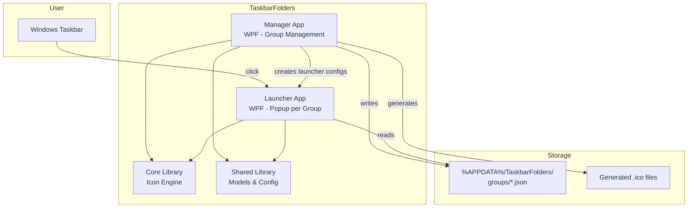
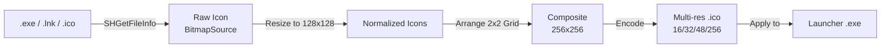

# Architecture Overview

> ⚠️ **Status: Pre-Alpha (v0.1.x).** This document describes the target architecture. Components marked ✅ exist in code; components marked 🚧 are planned. Today only the project skeleton (csproj structure, interface stubs, models) is in place.

## System Overview

TaskbarFolders consists of two main executables and two shared libraries:

## Components

### Manager (TaskbarFolders.Manager) 🚧

The main WPF application where users create, edit, and delete groups. Uses MVVM pattern with dependency injection.

**Responsibilities:**
- 🚧 Group CRUD operations
- 🚧 Drag & drop of .exe/.lnk files
- 🚧 Live preview of composite icons
- 🚧 Settings management (autostart, theme, animations)
- 🚧 Generating launcher configurations and composite icons

### Launcher (TaskbarFolders.Launcher) 🚧

A lightweight WPF application. Each taskbar group uses the same launcher binary, differentiated by command-line arguments or config file association.

**Responsibilities:**
- 🚧 Read group configuration on startup
- 🚧 Display animated popup with app grid
- 🚧 Launch selected applications
- 🚧 Auto-close on focus loss
- 🚧 Position popup near taskbar

### Core (TaskbarFolders.Core)

The icon processing engine.

**Responsibilities:**
- 🚧 Extract icons from .exe, .lnk, and .ico files via Windows Shell API (interface ✅ `IIconExtractor`)
- 🚧 Generate 2x2 composite icons (interface ✅ `ICompositeIconGenerator`)
- 🚧 Write multi-resolution .ico files
- 🚧 Cache generated icons

### Shared (TaskbarFolders.Shared)

DTOs, configuration models, and shared utilities.

**Responsibilities:**
- ✅ Data models (`AppEntry`, `GroupConfig`, `AppSettings`)
- 🚧 JSON configuration persistence
- 🚧 Path utilities

## Data Flow 🚧

> 🚧 **All flows below describe planned behavior. None of these steps execute in v0.1.x.**

### Creating a Group

1. User creates group in Manager
2. User drags apps into the group
3. Core extracts icons from each app
4. Core generates 2x2 composite icon
5. Manager writes GroupConfig JSON to %APPDATA%
6. Manager generates .ico file for the group

### Launching from Taskbar

1. User clicks pinned group icon in taskbar
2. Launcher starts with group ID argument
3. Launcher reads GroupConfig from %APPDATA%
4. Popup window appears near taskbar with app grid
5. User clicks an app icon
6. Launcher starts the selected application
7. Popup closes

## Design Decisions

- **WPF over WinUI 3**: See [ADR-001](adr/001-wpf-over-winui.md)
- **JSON config over database**: Simple, human-readable, no external dependencies
- **P/Invoke for icon extraction**: Direct Windows Shell API for maximum compatibility
- **Separate launcher binary**: Each group needs its own taskbar identity (icon + name)

## Icon Engine Pipeline 🚧

