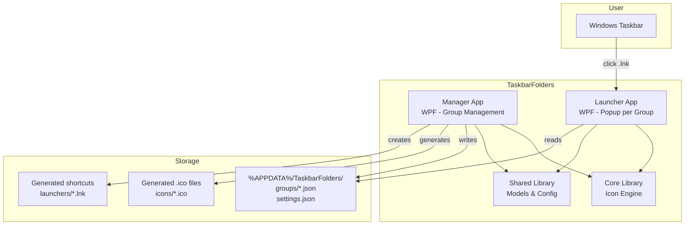
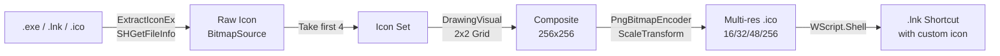

# Architecture Overview

## System Overview

TaskbarFolders consists of two main executables and two shared libraries:



## Components

### Manager (TaskbarFolders.Manager)

The main WPF application where users create, edit, and delete groups. Uses MVVM pattern with dependency injection.

**Responsibilities:**
- Group CRUD operations via sidebar/content master-detail layout
- Drag & drop of .exe/.lnk files via `FileDragDropBehavior`
- Live preview of composite icons in the group editor
- Settings management (autostart, theme, animations, popup position)
- Generating composite .ico files and .lnk shortcuts per group
- Cleanup of all generated files on group delete

**Key classes:**
- `MainViewModel` -- Group list, navigation, CRUD commands
- `GroupEditorViewModel` -- App management, composite preview, save/shortcut generation
- `SettingsViewModel` -- Settings load/save
- `LauncherGenerator` -- .ico + .lnk generation, Launcher.exe discovery

### Launcher (TaskbarFolders.Launcher)

A lightweight WPF application. Each taskbar shortcut points to the same Launcher binary, differentiated by `--group-id` command-line argument.

**Responsibilities:**
- Parse `--group-id` from command-line arguments
- Read group configuration from JSON on startup
- Display popup with app icon grid (UniformGrid)
- Launch selected applications via `Process.Start`
- Auto-close on focus loss via `FocusLossBehavior`
- Position popup near taskbar using `SHAppBarMessage` + `GetCursorPos`

### Core (TaskbarFolders.Core)

The icon processing engine.

**Key classes:**
- `ShellIconExtractor` -- Extracts icons via ExtractIconEx, SHGetFileInfo, IconBitmapDecoder; resolves .lnk via WScript.Shell COM
- `CompositeIconGenerator` -- DrawingVisual-based 2x2 grid with rounded background
- `IcoWriter` -- Writes multi-resolution .ico files (16/32/48/256 PNG entries)
- `IconCache` -- ConcurrentDictionary in-memory cache + PNG disk cache with SHA256 keys
- `NativeMethods` -- P/Invoke declarations (SHGetFileInfo via DllImport, ExtractIconEx/DestroyIcon via LibraryImport)

### Shared (TaskbarFolders.Shared)

DTOs, configuration models, and shared utilities.

**Key classes:**
- `AppEntry`, `GroupConfig`, `AppSettings` -- Data models
- `JsonGroupConfigStore` -- Per-group JSON files in `%APPDATA%/TaskbarFolders/groups/`
- `JsonAppSettingsStore` -- Single `settings.json` file
- `PathHelper` -- Centralized path constants and directory management

## Data Flow

### Creating and Pinning a Group

1. User creates group in Manager, enters name and column count
2. User drags .exe/.lnk files into the drop zone
3. `ShellIconExtractor` extracts icons from each app
4. `CompositeIconGenerator` creates 2x2 composite icon (live preview)
5. User clicks Save:
   - `JsonGroupConfigStore` writes GroupConfig JSON to `%APPDATA%`
   - `IcoWriter` writes multi-resolution .ico from composite
   - `LauncherGenerator` creates .lnk shortcut (target: Launcher.exe, args: `--group-id <id>`, icon: composite .ico)
6. User clicks "Ordner offnen" to reveal the shortcut in Explorer
7. User drags .lnk to taskbar to pin

### Launching from Taskbar

1. User clicks pinned shortcut in taskbar
2. Windows launches `TaskbarFolders.Launcher.exe --group-id <id>`
3. Launcher parses group ID, loads GroupConfig JSON
4. `TaskbarPositionHelper` determines taskbar edge via `SHAppBarMessage`
5. Popup window opens near cursor with app icon grid
6. User clicks an app icon -> `ProcessLauncher.Launch()` via `Process.Start`
7. Popup closes (or closes on focus loss via `FocusLossBehavior`)

## Storage Layout

```
%APPDATA%/TaskbarFolders/
├── groups/
│   ├── <guid1>.json          # GroupConfig per group
│   └── <guid2>.json
├── icons/
│   ├── <guid1>.ico           # Composite icon per group
│   └── <guid2>.ico
├── launchers/
│   ├── DevTools_a1b2c3d4.lnk # Shortcut per group
│   └── Games_e5f6g7h8.lnk
└── settings.json             # Global app settings
```

## Design Decisions

- **WPF over WinUI 3**: See [ADR-001](adr/001-wpf-over-winui.md)
- **JSON config over database**: Simple, human-readable, no external dependencies
- **P/Invoke for icon extraction**: Direct Windows Shell API for maximum compatibility
- **Single Launcher binary**: All groups share one exe, differentiated by `--group-id` argument
- **.lnk shortcuts for pinning**: Standard Windows shortcut format with custom icon; user drags to taskbar
- **DllImport for SHGetFileInfo**: SHFILEINFO struct requires manual marshalling not supported by LibraryImport source generator
- **LibraryImport for simple P/Invoke**: ExtractIconEx, DestroyIcon, SHAppBarMessage use source-generated marshalling

## Icon Engine Pipeline


